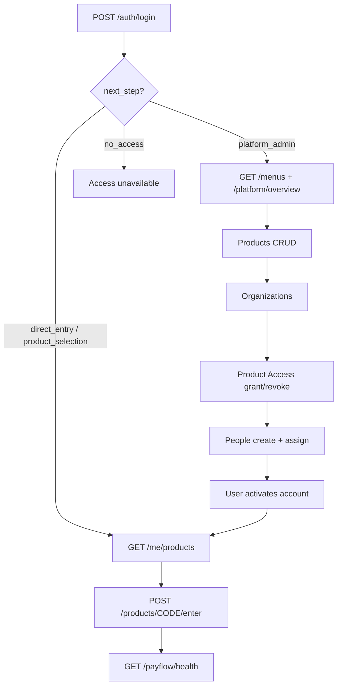

# Platform Suite — API Flow Guide

Swagger: http://127.0.0.1:8000/docs  
Auth: har protected API pe `Authorization: Bearer <access_token>`

---

## Big picture (kis order mein socho)

```text
1. Login
2. Menus / Overview (admin shell)
3. Products register karo
4. Organizations banao (agar nahi hain)
5. Org ko Product Access grant karo
6. People (users) add karo + products assign karo
7. User activate (password set)
8. User login → products list → enter product
9. Logout / forgot-password jab zaroorat ho
```



---

## Flow A — Platform Super Admin (setup)

Pehle yeh sequence Swagger pe chalao.

| Step | Method | API | Kaam |
|------|--------|-----|------|
| 1 | `POST` | `/auth/login` | Admin login. Response se **access_token** lo. Authorize mein paste karo. |
| 2 | `GET` | `/auth/me` | Current user + products + `next_step` check. |
| 3 | `GET` | `/menus?context=platform_admin` | Sidebar menus (Overview, Products, People, Billing Soon…). |
| 4 | `GET` | `/platform/overview` | KPI cards: products count, orgs with access, summaries. |
| 5 | `GET` | `/products` | Registered products list. |
| 6 | `POST` | `/products` | **Create** product (bina `id`). Update = same API with `id`. |
| 7 | `GET` | `/products/{id}` | Ek product detail (id = 1, 2, 3…). |
| 8 | `GET` | `/organizations` | Orgs list. |
| 9 | `POST` | `/organizations` | Create/update org (`id` optional). |
| 10 | `GET` | `/product-access` | Matrix: org × product = granted/revoked. |
| 11 | `POST` | `/product-access/grant` | Org ko product entitlement do. |
| 12 | `POST` | `/product-access/revoke` | Entitlement hatao (soft revoke). |
| 13 | `GET` | `/people` | Platform users list. |
| 14 | `POST` | `/people` | Naya user create → invite `email_logs` + `activation_link` response mein. Optional `product_ids`. |
| 15 | `POST` | `/people/assign-product` | User ko product assign. |
| 16 | `POST` | `/people/remove-product` | Assignment hatao. |
| 17 | `POST` | `/people/resend-invite` | Activation email dubara (`email_logs` + link). |
| 18 | `GET` | `/email-logs` | Logged emails (SMTP nahi — link yahan se copy). |

**Zaroori rule:** Product enter tabhi hoga jab **dono** hon:
1. Org pe product **granted**
2. User pe product **assigned**

---

## Flow B — Naya user activate (invitation)

Admin ne `POST /people` kiya → row `email_logs` mein save hoti hai (`action_link` ke sath). SMTP nahi — link FE `/activate?token=...` pe kholo.

| Step | Method | API | Kaam |
|------|--------|-----|------|
| 1 | `GET` | `/email-logs` | Latest invite link copy (ya People create response se). |
| 2 | `GET` | `/auth/activation/{token}` | Email read-only + link valid? |
| 3 | `POST` | `/auth/activate` | Password set → account **active**. |
| 4 | `POST` | `/auth/login` | Ab naye password se login. |

---

## Flow C — Normal user product use kare

| Step | Method | API | Kaam |
|------|--------|-----|------|
| 1 | `POST` | `/auth/login` | Login. Dekho `next_step` + `products`. |
| 2 | `GET` | `/me/products` | Jo products effectively allowed hain. |
| 3 | `POST` | `/products/PAYFLOW/enter` | Entitlement dubara check; enter allow/deny. |
| 4 | `GET` | `/payflow/health` | PayFlow gate passed (thin product API). |

`next_step` meanings:
- `platform_admin` → admin area kholo
- `direct_entry` → 1 product → seedha enter
- `product_selection` → multiple → launcher dikhao
- `no_access` → koi product nahi

---

## Flow D — Session / password

| Step | Method | API | Kaam |
|------|--------|-----|------|
| — | `POST` | `/auth/refresh` | Naya access_token (refresh_token se). |
| — | `POST` | `/auth/logout` | Session khatam. |
| — | `POST` | `/auth/forgot-password` | Reset email (privacy: hamesha same message). |
| — | `POST` | `/auth/reset-password` | Naya password set (token se). |

---

## Har API — short dictionary

### Login group
| API | Kam |
|-----|-----|
| `POST /auth/login` | Email+password → JWT + products + next_step |
| `GET /auth/me` | Current session user |
| `POST /auth/refresh` | Token renew |
| `POST /auth/logout` | Logout / revoke |
| `POST /auth/forgot-password` | Reset request |
| `GET /auth/activation/{token}` | Invite preview |
| `POST /auth/activate` | First password + activate |
| `POST /auth/reset-password` | Password reset complete |

### Platform admin
| API | Kam |
|-----|-----|
| `GET /menus` | Dynamic sidebar |
| `GET /platform/overview` | Admin KPIs |
| `GET/POST /products` | List / save product |
| `GET /products/{id}` | Product detail |
| `GET/POST /organizations` | List / save org |
| `GET /product-access` | Entitlement matrix |
| `POST /product-access/grant` | Grant org access |
| `POST /product-access/revoke` | Revoke org access |
| `GET/POST /people` | List / save user |
| `POST /people/assign-product` | Assign product to user |
| `POST /people/remove-product` | Remove assignment |
| `POST /people/resend-invite` | Resend activation |
| `GET /email-logs` | Logged outbound emails + action links |
| `GET /platform/billing` | Coming soon (501) |

### Product entry
| API | Kam |
|-----|-----|
| `GET /me/products` | My entitled products |
| `POST /products/{code}/enter` | Enter product (re-check access) |
| `GET /payflow/health` | PayFlow protected ping |

### Misc
| API | Kam |
|-----|-----|
| `GET /health` | API up? (no auth) |

---

## Create vs Update (POST pattern)

Products / Organizations / People — **ek hi POST**:
- **Create:** body mein `id` mat bhejo  
- **Update:** body mein `id` bhejo (`1`, `2`, `3`… products/orgs ke liye)

Users ka `id` UUID hai; products/orgs ka `id` integer hai.

---

## Seeded admin (testing)

`.env` se (default):
- Email: `admin@payflow.ai`
- Password: `Admin@12345`
